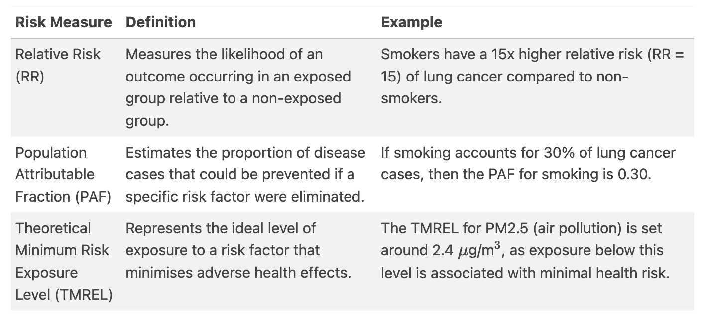

# Causes and Risks

**Learning objectives:**

- Overview of the causes and risks related to health metrics calculation
- Identify the objective of the research question
- Learn how causal inference can be used to estimate the effect of an exposure on an outcome

## Introduction {-}

> 👉 “**Fear is the most pervasive emotion of modern society**—shaping our decisions, driving public policy, and influencing how we perceive risk. But how much of it is justified?”

 explores the history of fear and how it has shaped our society. Fear is a powerful emotion that can influence our decisions and perceptions of risk. It can be a useful tool for survival, but it can also lead to irrational behavior and poor decision-making.](images/ch5-fear.png){width=100% align=center}


```{r echo=FALSE, fig.align='center', fig.cap="Risk Perception", out.width = "100%"}
library(DiagrammeR)

grViz("
digraph risk_perception {
  
  # Define graph attributes
  graph [layout = dot, rankdir = TB]
  
  # Define nodes
  node [shape = box, style = filled, fillcolor = lightblue] 
  A [label = 'Historical Risks']
  B1 [label = 'Starvation']
  B2 [label = 'Infectious Diseases']
  B3 [label = 'Violent Conflicts']
  
  node [shape = box, style = filled, fillcolor = green]
  C [label = 'Modern Risks']
  D1 [label = 'Chronic Diseases (Obesity, CVD, Cancer)']
  D2 [label = 'Perceived Threats (Terrorism, Pandemics, Environment)']
  
  node [shape = ellipse, style = filled, fillcolor = lightcoral]
  E [label = 'GBD Risk Factors']
  F1 [label = 'Behavioral']
  F2 [label = 'Environmental']
  F3 [label = 'Occupational']
  F4 [label = 'Metabolic']

  # Define edges
  A -> B1
  A -> B2
  A -> B3
  A -> C
  C -> D1
  C -> D2
  C -> E
  E -> F1
  E -> F2
  E -> F3
  E -> F4
}
")
```


## 🛑 Conditions and Injuries {-}


```{r echo=FALSE, fig.align='center', fig.cap="Risk Factors", out.width = "100%"}
library(DiagrammeR)

grViz("
digraph risk_factors {
  
  # Define graph attributes
  graph [layout = dot, rankdir = LR]

  # Define nodes
  node [shape = box, style = filled, fillcolor = lightblue] 
  A [label = 'Causes and Risk Factors']
  
  node [shape = box, style = filled, fillcolor = green]
  B1 [label = 'Lifestyle Choices']
  B2 [label = 'Environmental Factors']
  B3 [label = 'Infections']
  B4 [label = 'Poverty']
  B5 [label = 'Ageing']
  B6 [label = 'Genetics']
  B7 [label = 'Injuries']

  node [shape = ellipse, style = filled, fillcolor = lightcoral]
  C1 [label = 'Heart Disease, Stroke, Cancer, Liver Disease']
  C2 [label = 'Respiratory Diseases, Organ Damage']
  C3 [label = 'Tuberculosis, HIV/AIDS, Malaria']
  C4 [label = 'Limited Healthcare, Poor Nutrition']
  C5 [label = 'Chronic Diseases, Disabilities']
  C6 [label = 'Hereditary Diseases, Certain Cancers']
  C7 [label = 'Falls, Accidents, Violence']

  # Define edges
  A -> B1
  A -> B2
  A -> B3
  A -> B4
  A -> B5
  A -> B6
  A -> B7
  
  B1 -> C1
  B2 -> C2
  B3 -> C3
  B4 -> C4
  B5 -> C5
  B6 -> C6
  B7 -> C7
}
")
```

## 💥 Risk Factors and Health Metrics {-}

> the likelihood that an individual will experience a specific health outcome, such as illness or injury, due to certain behaviours, exposures, or conditions.

### Risk-Specific Exposures

- smoking, physical inactivity, high blood pressure (hypertension), and others.

### Risk-Specific Outcomes

- **Injuries**: falls, accidents, violence

- **Diseases**: heart disease, stroke, cancer, liver disease, respiratory diseases, organ damage, tuberculosis, HIV/AIDS, malaria, chronic diseases, disabilities, hereditary diseases, certain cancers

### Risk-Specific Populations

- **Ageing**: older adults
- **Genetics**: individuals with hereditary diseases or certain cancers
- **Poverty**: individuals with limited access to healthcare and poor nutrition


### Risk Measures

- Relative Risks $RR = \frac{P(E|D)}{P(E|D^c)}$ which is the ratio of the probability of exposure among cases to the probability of exposure among non-cases.
- Theoretical Minimum-Risk Exposure Levels $TMREL = \frac{P(E|D)}{P(E|D^c)}$ which is the lowest level of exposure that would result in the lowest risk of disease.
- Population Attributable Fractions $PAF = \frac{P(D) - P(D|E)}{P(D)}$ which is the proportion of disease that would be eliminated if the exposure were removed.

## Causal Inference {-}

> 👉 “the process of drawing a conclusion about a causal connection based on the conditions of the occurrence of an effect.”

## Summarising the Relationship Between Risk and Outcome {-}

{width=100% align=center}

## Meeting Videos {-}

### Cohort 1 {-}

`r knitr::include_url("https://www.youtube.com/embed/URL")`

<details>
<summary> Meeting chat log </summary>

```
LOG
```
</details>
