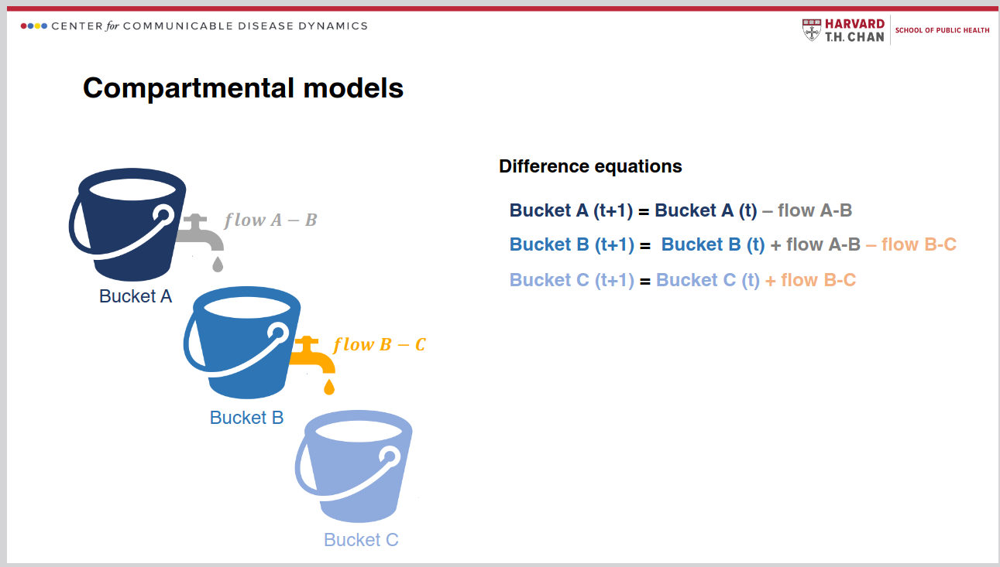

# (PART\*) Machine Learning {-}

# Introduction to Machine Learning

**Learning objectives:**

- See a basic construction of a machine learning model.
- Review an example of modelling a fast-growing phenomenon.

## 6.1 Deterministic and Stochastic Modelling {-}

- A **stochastic** model attempts to replicate random behaviour, using probabilities.
- A **deterministic** model can make predictions under certain assumptions, but will not model randomness.

Most models used for studying the spread of a virus use a combination of these two approaches.

## 6.2 Machine Learning Models {-}

- Sub-field of AI.
- Differ from statistical models in the way parameters are calibrated.
- ML models 'learn' from data and automatically adjust parameters.

Key steps in the data pipeline for deploying a machine learning model:

```{r mermaid, echo=FALSE, out.width="200%"}

```

The goal is to make accurate predictions or decisions based on data.

```{r echo=FALSE, width="100%", fig.align='center'}
# DiagrammeR::DiagrammeR(
# "graph TB
#     A[Data collection] --> B[Data preprocessing]
#     B --> C[Model selection]
#     C --> D[Model training]
#     D --> E[Model evaluation]
#     E --> F[Model deployment]
#     E --> A
#     F --> A
# ")
```

## 6.2.1 Empirically Driven and Mechanistic Models {-}

- **Mechanistic**, e.g., the SIR model (Susceptible, Infectious, Recovered), also known as a *compartmental model*.
- Based on explicit equations and known relationships between variables.

Differential equations for the SIR model:

\begin{cases}

\frac{dS}{dt}=-\beta \frac{I}{N}S\\\\
\frac{dI}{dt}=\beta \frac{I}{N}S - \gamma I \\\\
\frac{dR}{dt}=\gamma I

\end{cases}

$\beta$: infectiousness

$N$: population size ($S + I + R$)

$\gamma$: recovery



[From: Introduction to SIR Modelling.](https://content.sph.harvard.edu/wwwhsph/sites/137/2024/04/Lecture-1_SIR-Models.pdf)

## 6.2.1 Empirically Driven Models {-}

- ML models are empirically-driven.
- Learn patterns from the data.
- Example is **Random Forest**

The random forest diagram below uses <code>R</code>'s *iris* data to elucidate species relationships based on the lengths and widths of petals and sepals.


[Image obtained from Yong Cui, 2020](https://towardsdatascience.com/the-iris-dataset-a-little-bit-of-history-and-biology-fb4812f5a7b5)

```{r rf-code, echo=FALSE, include=FALSE}
library(randomForest)
library(reprtree)

model <- randomForest(Species ~ ., data = iris, importance = TRUE, ntree = 500, mtry = 2, do.trace = 100)

```

```{r rf-diagram, echo=FALSE}
reprtree:::plot.getTree(model)
```

## 6.2.2 Learning Methods {-}

ML models use two main types of methods for learning:

- Supervised (labelled) - dataset includes both the independent (predictors) and dependent (outcome) variables.
- Unsupervised (unlabelled) - only includes the input variables, so there is no direct objective, or “response” variable.
- Model choice can depend on several factors, e.g., data type, complexity, research question.

Start simple!

## 6.2.3 Parameters and Hyper-parameters {-}

These are crucial for building and tuning models.

- In a linear regression model, **parameters** are the intercept and slope.
- **Hyperparameters** are sample size, the number of trees on a random forest model, the learning rate, the regularisation setting (λ) in ridge and lasso regression.

When modelling infectious diseases, it is important to understand the underlying patterns and dynamics of growth.

## 6.3 The Steps of Building a Model {-}

```{r digraph, echo=FALSE}
DiagrammeR::grViz("digraph flowchart {
      # node definitions with substituted label text
      node [fontname = Helvetica, shape = rectangle]        
      tab1 [label = '@@1']
      tab2 [label = '@@2']
      tab3 [label = '@@3']
      tab4 [label = '@@4']
      tab5 [label = '@@5']
      tab6 [label = '@@6']
      tab7 [label = '@@7']

      # edge definitions with the node IDs
      tab1 -> tab2 -> tab3 -> tab4 -> tab5 -> tab6 -> tab7;
      }

      [1]: 'Data Collection \\n Ensure data completeness'
      [2]: 'Data Cleaning \\n Handle missing values, remove outliers'
      [3]: 'Feature Selection \\n Select relevant variables'
      [4]: 'Model Training \\n Apply chosen algorithms'
      [5]: 'Model Evaluation \\n Assess model performance'
      [6]: 'Model Tuning \\n Optimise model parameters'
      [7]: 'Model Deployment \\n Integrate into real world applications'
      ")
```

**The Model Function**

$y = f(x_1, x_2, ...) + \epsilon$

where

$y$ is the response, e.g., number of deaths or infections.

$x_1, x_2, ...$ are predictors that might affect $y$, e.g., vaccinations, demographics.

$\epsilon$ is the error term (difference between observed values of $y$ and predicted values from the model.

- Machine learning algorithms optimise the coefficients to minimise the difference between the observed and predicted values, and can handle complex structures.

- Model function can be used on new $x$ values to predict future values of $y$.

## 6.3.1 Example: Cholera {-}

Deaths due to cholera over 12 months in 1849 (from the {HistData} package):

``` {r example-cholera, message=FALSE}
library(tidyverse)
library(HistData)

cholera <- HistData::CholeraDeaths1849 %>%
  filter(cause_of_death == "Cholera") %>%
  select(date, deaths)

cholera %>% head()
```

Response ($y$) = deaths.

Predictor ($x$) = date.

```{r cholera-plot, echo=FALSE}
cholera %>%
  ggplot(aes(x = date, y = deaths)) +
  geom_line() +
  labs(
    title = "Deaths due to Cholera in London (1849)",
    x = "Date", y = "N. deaths") +
   theme_bw()

```

**How to model this?**

Review the relationship between response and predictor:

- Equation of a line: $y = \beta_0 + \beta_1x$ or ($y=mx+b$)

- $\beta_0$ - intercept, or value of $y$ when $x = 0$

- $\beta_1$ - average change in $y$ for each unit increase in $x$

- $x$ - value of the predictor

Often there are multiple predictors, adding more complexity to a model.

*Modelling estimates these values*

**Linear models and Locally estimated scatter plot smoothing (LOESS)**

Linear model

- Assumes linear relationship.

```{r cholera-lm, echo=FALSE, message=FALSE}
cholera %>%
  filter(date >= "1849-06-01" & date <= "1849-08-01") %>%
  ggplot(aes(x = date, y = deaths)) +
  geom_point() +
  geom_smooth(method = "lm", se = F) +
  labs(
    title = "Deaths due to Cholera in London (June to August 1849)",
    subtitle = "Linear Model",
    x = "Date", y = "N. deaths") +
   theme_bw()
```

Locally estimated scatter plot smoothing (LOESS)

- No underlying assumptions made about the structure of the data.

```{r cholera-loess, echo=FALSE, message=FALSE}
cholera %>%
  filter(date <= "1849-08-01") %>%
  ggplot(aes(x = date, y = deaths)) +
  geom_point() +
  geom_smooth(se = F) +
  labs(
    title = "Deaths due to Cholera in London (January to August 1849)",
    subtitle = "method LOESS",
    x = "Date", y = "N. deaths") +
   theme_bw()
```

**Comparing linear and non-linear models**

Plotting a linear model against a generalised additive model (GAM):

```{r cholera-gam, echo=FALSE, message=FALSE}
ggplot(cholera, aes(x = date, y = deaths)) +
  geom_line() +
  geom_smooth(method = "lm", se = F) +
  geom_smooth(method = "gam",
              color = "darkred", se = F) +
    labs(
    title = "Deaths due to Cholera in London 1849",
    subtitle = "methods linear and GAM",
    x = "Date", y = "N. deaths") +
   theme_bw()
```

#### GAM - Generalised Additive Model {-}

What are they?

- Flexible extensions of linear models.
- Useful for modelling complex relationships between response ($y$) and predictor(s) ($x_1,...x_n$).

$g(\mu) = \beta_0 + f(x)$

- Predictors are transformed through each function $x \sim f(x)$.
- Link function $g(\mu)$ is chosen based on response distribution.

**How to do this in R?**

```{r mgcv-gam, message=FALSE}
# Load the mgcv package
library(mgcv)

# Use the days instead of the full date
cholera$days <- row_number(cholera)

# Look at the first six rows
head(cholera)

# Fit a GAM using the gam() function
gam_model <- gam(deaths ~ s(days), data = cholera)

# Print the summary of the GAM model
summary(gam_model)

```

Key points:

- Intercept is modelled as a parametric term.
- Days is a smooth term: s(days).
- Effective degrees of freedom (EDF) is ~9, indicating a wiggly (non-linear) relationship to deaths.
- Adjusted R-squared value indicates the model explains approx. 91.4% of variance in $y$.
- Deviance value of 91.6% indicates a good fit.

```{r plot-gam}
plot(gam_model)
```

However, the model is very simple with only one predictor. In reality there are likely to be many other factors that influence number of deaths.

## 6.3.2 Example: Epidemic X {-}

### 6.3.2.1 The SEIR Model {-}

What happens if an infectious disease has an incubation period?

Scenario: simulate an epidemic to build an SEIR model (susceptible, **exposed**, infected, recovered).

**How to use this in practice?**

The {deSolve} package uses differential equations.

```{r desolve, message=FALSE, echo=FALSE}
library(deSolve) # For solving differential equations
library(ggplot2) # For visualisation
```

1. Define a function for the SEIR model and its parameters, where:

- $\beta$ is the transmission rate
- $\sigma$ is the rate of latent individuals becoming infectious
- $\gamma$ is the rate of recovery

```{r seir-model, message=TRUE}
SEIR <- function(time, state, parameters) {
  # variables need to be in a list
  with(as.list(c(state, parameters)), {
    # Parameters
    beta <- parameters[1] # Transmission rate
    sigma <- parameters[2] # Rate of latent individuals becoming infectious
    gamma <- parameters[3] # Rate of recovery

    # SEIR equations
    dS <- -beta * S * I / N
    dE <- beta * S * I / N - sigma * E
    dI <- sigma * E - gamma * I
    dR <- gamma * I

    # Return derivatives
    return(list(c(dS, dE, dI, dR)))
  })
}

```

2. Simulate starting parameters by assigning values.

```{r seir-parameters, message=FALSE}
N <- 1000 # Total population size
beta <- 0.3 # Transmission rate
sigma <- 0.1 # Rate of latent individuals becoming infectious
gamma <- 0.05 # Rate of recovery
```

3. Set an initial state and a time vector.

```{r seir-time, message=FALSE}
initial_state <- c(S = N - 1, E = 1, I = 0, R = 0)

# Time vector
times <- seq(0, 100, by = 1)
```

4. Use the <code>ode()</code> function from the deSolve package for solving the differential equations in the the SEIR model function created.

```{r seir-solve, message=FALSE}
output <- deSolve::ode(y = initial_state,
                       times = times,
                       func = SEIR,
                       parms = c(beta = beta,
                                 sigma = sigma,
                                 gamma = gamma))

```

The output is a matrix. To convert to a data frame:

```{r seir-dataframe, message=FALSE}
simulated_data <- as.data.frame(output)

head(simulated_data)
```

Plotting the simulated data of the SEIR model, with the number of susceptible, exposed, infectious, and recovered individuals over time.

```{r sim-data-long, include=FALSE}
# Need data in long format for plotting with line labels
simluated_data_long <- simulated_data %>% 
  pivot_longer(cols = 2:5,
               names_to = "type",
               values_to = "value")

library(ggtext) # formatting text labels

dat_label <- subset(simluated_data_long, time == max(time))
```

```{r seir-plot, echo=FALSE}
simluated_data_long %>% 
  ggplot(aes(time,
             value,
             color = type,
             linetype = type)) +
  geom_line(linewidth = 0.9,
            show.legend = FALSE) +
  geom_richtext(data = dat_label,
                aes(label = type),
                color = "black", 
                label.size = NA,
                label.margin = unit(4,
                                    "pt"),
                label.padding = unit(3,
                                     "pt"),
                hjust = 0,
                show.legend = FALSE) +
  coord_cartesian(clip = "off") +
  guides(color = "none") +
  labs(title = "Simulation of SEIR Model", 
       x = "Time",
       y = "Population") +
  scale_color_manual(values = c(
    "S" = "navy",
    "E" = "#8134DF",
    "I" = "brown",
    "R" = "darkgreen")) +
  theme_bw()

```

Plot shows how individuals interact with each other over time.

## 6.3.2.2 Random Forest {-}

Using machine learning to calibrate the model.

**Random forest** models:

- Use ensemble learning to build multiple decision trees.

- Combine predictions to improve accuracy and reduce variance.

- Are used for classification and regression.

[A nice graphical description of the random forest algorithm - in Python.](https://medium.com/data-science/random-forest-explained-a-visual-guide-with-code-examples-9f736a6e1b3c)

<code>R</code> package {randomForest} is used to predict the number of new infections and train the model.

Step 1: Add some 'noise' to the simulated data.

```{r ml-noise}
simulated_data <- cbind(simulated_data,
                        noise = rnorm(nrow(simulated_data),
                                      mean = 0, 
                                      sd = 5))

head(simulated_data)
```

Step 2: Split data into *training* and *testing* sets (assess predictive performance).

```{r ml-split-data}
# Load required packages
library(randomForest)

# Split the data into training and testing sets
set.seed(123) # This makes the process reproducible

train_index <- sample(nrow(simulated_data), 
                      0.8 * nrow(simulated_data))
train_data <- simulated_data[train_index, ] # 80 observations
test_data <- simulated_data[-train_index, ] # 21 observations

# Train the Random Forest model - non machine learning yet!
rf_model <- randomForest(
  formula = I ~ .,
  data = round(train_data)
)
```

The number of infections is the response variable.

Step 3: Predicting new infections.

Use the <code>predict()</code> function on the test data.

```{r ml-predict}
# Make predictions on the test set
predictions <- predict(rf_model, newdata = test_data)

# Calculate Root Mean Squared Error (RMSE)
(rmse <- sqrt(mean((test_data$I - predictions)^2, na.rm = T)))
```

The Root Mean Squared Error quantifies how much the predicted values deviate from the actual values (smaller is better).

The model’s predictions deviate from the actual values by an average of
`r (rmse <- round(sqrt(mean((test_data$I - predictions)^2, na.rm = T)), 2))` new infections.

Plots of infection numbers against predicted values, and observed vs estimated values against day, show some improvement in the fit: 

```{r simulated-plots, echo=FALSE}
cbind(test_data, pred = predictions) %>%
  ggplot(aes(I, pred)) +
  geom_point() +
  geom_abline() +
  labs(
    title = "Prediction of Infections for Epidemic X",
    subtitle = "Simulated Data",
    x = "Infections", y = "Predicted values") +
  theme_bw()

cbind(test_data, pred = predictions) %>%
  ggplot(aes(x = time)) +
  geom_point(aes(y = I)) +
  geom_line(aes(y = pred), color = "navy") +
  labs(
    title = "Prediction of Infections for Epidemic X",
    subtitle = "Simulated Data",
    x = "Time (Day)", y = "Obeserved vs Estimated values") +
  theme_bw()
```

## 6.3.2.3 Optimization with Tidymodels {-}

- Hyperparameters can be tuned to improve model performance.

For a random forest model, these can be:

- Number of trees.

- Number of variables to consider at each split.

- Minimum number of data points required to split a node.

The {tidymodels} package makes this process easier.

```{r ml-load-tidymodels, message=FALSE, warning=FALSE}
library(tidymodels)
library(dials)
library(ranger)
tidymodels_prefer()

```


```{r ml-rfmodel}
# Spending data
set.seed(1231) # Set seed for reproducibility

# Split the data into training and testing sets
split <- initial_split(simulated_data, prop = 0.8)
train_data <- training(split)
test_data <- testing(split)

# Create a resampling scheme: 5-fold cross-validation
# 
cv_folds <- vfold_cv(train_data, v = 5)

# Create a recipe for data preprocessing
data_recipe <- recipe(I ~ ., data = train_data) %>%
  step_nzv(all_predictors()) %>% 
  step_normalize(all_numeric())

# Define the Random Forest model
rf_ranger_model <-
  # tuning parameters - Machine Learning Application
  rand_forest(trees = tune(),
              min_n = tune()) %>%
  set_engine("ranger") %>%
  set_mode("regression")
```

Bayesian Optimisation

**Bayes Theorem**

$$Pr(B|A) = \frac{Pr(A|B)*Pr(B)}{Pr(A)}$$
$A$ and $B$ are events and $B$ $\neq$ $0$

```{r ml-bayes, message=FALSE, warning=FALSE}
# Bayesian optimization
set.seed(123)
bayes_results <- tune_bayes(rf_ranger_model,
                            data_recipe,
                            resamples = cv_folds,
                            metrics = metric_set(yardstick::rmse, yardstick::rsq),
                            # Number of initial random points
                            initial = 5, 
                            # Total iterations including initial points
                            iter = 20, 
                            param_info = parameters(rf_ranger_model))
```

The show_best() function displays the best hyperparameters based on the optimization results.

```{r ml-optimise}
# Summarise the tuning results
show_best(bayes_results, metric = "rmse")
```

Extract the best parameters:

```{r ml-extract}
best_bayes <- select_best(bayes_results, metric = "rmse")

best_bayes
```

- The <code>fit()</code> function fits the model using the best hyperparameters.

- The <code>predict()</code> function makes predictions on the test data.

```{r ml-final-best}
# Final model with best parameters
final_bayes_model <- finalize_model(rf_ranger_model,
                                    best_bayes)

final_fit <- fit(final_bayes_model,
                 formula = I ~ .,
                 data = train_data)

# Predict and evaluate on test data
predictions <- predict(final_fit, new_data = test_data)
augumented <- augment(final_fit, new_data = test_data)
eval_metrics <- metrics(estimate = .pred,
                        truth = I,
                        data = augumented)

eval_metrics
```

```{r plot-eavl-metrics, echo=FALSE}
augumented %>%
  ggplot(aes(I, .pred)) +
  geom_point() +
  geom_abline() +
  labs(
    title = "Prediction of Infections for Epidemic X",
    subtitle = "Simulated Data",
    x = "Infections", y = "Predicted values") +
  theme_bw()

augumented %>%
  ggplot(aes(x = time)) +
  geom_point(aes(y = I)) +
  geom_line(aes(y = .pred), color = "navy") +
  labs(
    title = "Prediction of Infections for Epidemic X",
    subtitle = "Simulated Data",
    x = "Time (Day)", y = "Obesrved vs Estimated values") +
  theme_bw()
```

## 6.3.3 Example: Epidemic Y {-}

### 6.3.3.1 INLA: an empirical Bayes approach to GAMs {-}

Scenario: epidemic over 100 days based on temperature level and number of cases simulated with a random poisson distribution.

Model: INLA - integrated nested Laplace approximation model.

- A deterministic algorithm for Bayesian inference.

- Useful for fitting complex models (GAMs).

- Alternative to Markov Chain Monte Carlo (MCMC).

Additional reading that may be useful: [the R-INLA website, with tutorials and examples](https://www.r-inla.org/examples-tutorials) and [a gentle INLA tutorial.](https://www.precision-analytics.ca/articles/a-gentle-inla-tutorial/)

Install the INLA package (might take a while...)

```{r install-inla, message=FALSE, warning=FALSE, include=FALSE}
# install.packages("INLA",
#   repos = c(getOption("repos"),
#     INLA = "https://inla.r-inla-download.org/R/stable"),
#   dep = TRUE)

library(INLA)
```

Create the sample data.

```{r inla-data, warning=FALSE}
set.seed(123)
epidemic_data <- data.frame(
  day = 1:100,
  temperature = rnorm(100, mean = 20, sd = 5),
  cases = rpois(100,
                lambda = 10 + sin(1:100 / 20) * 10 + rnorm(100, 
                                                           sd = 5)))

# View the first few rows of data
head(epidemic_data)
```

* Model the number of cases as a function of time and temperature
  + non-linear effect of time using a random walk model (model = "rw2")
  + linear effect of temperature

```{r random-walk}
# Define the model formula
formula <- cases ~ f(day, model = "rw2") + temperature

# Fit the model using INLA
result <- inla(formula,
               family = "poisson",
               data = epidemic_data)
```

Check the results:

```{r inla-results}
result$summary.fixed
```

- kld refers to [Kullback and Leibler (1951).](https://www.projecteuclid.org/journals/annals-of-mathematical-statistics/volume-22/issue-1/On-Information-and-Sufficiency/10.1214/aoms/1177729694.full?tab=ArticleLink)

The predicted number of cases per day can be extracted and plotted:

```{r inla-predict}
time_effect <- result$summary.random$day

fitted_values <- result$summary.fitted.values

# Creating a data frame for plotting
plot_data <- data.frame(Day = epidemic_data$day,
                        FittedCases = fitted_values$mean,
                        Lower = fitted_values$`0.025quant`,
                        Upper = fitted_values$`0.975quant`)
```

```{r plot-inla, echo=FALSE}
# Plotting the results
ggplot(plot_data, aes(x = Day)) +
  geom_ribbon(aes(ymin = Lower, ymax = Upper),
              fill = "lightblue",
              alpha = 0.4) +
  geom_line(aes(y = FittedCases),
            color = "blue") +
  labs(title = "Fitted GAM for Epidemic Y",
       x = "Day", y = "Fitted number of cases") +
  theme_bw()
```

[Further recommended reading: Chapter 3 The R-INLA package, from Geospatial Health Data: Modeling and Visualization with R-INLA and Shiny.](https://www.paulamoraga.com/book-geospatial/sec-inla.html)

## 6.4 Measures of Machine Learning Models {-}

Evaluating the performance of machine learning models to assess generalisation to new data.

- Loss functions

- Evaluation metrics

- Public health loss functions

## 6.4.1 Loss Functions {-}

* Regression loss functions - continuous data.
    
* Classification loss functions - categorical data.

## 6.4.2 Evaluation Metrics {-}

* Regression evaluation metrics.
  
* Classification evaluation metrics.

  + Accuracy
  + Precision
  + Sensitivity
  + Specificity
  + F1 score
  + Receiver Operating Characteristic (ROC) Curve
  + Area Under the Curve (AUC)
 
## 6.4.3 Public Health Loss Functions {-}

- Cost-utility, using quality-adjusted life years (QALY)
- Cost-effectiveness, for specific outcomes, such as life expectancy or medical outcomes.

Measures for a cost-effectiveness intervention need to balance mortality, morbidity, and disability.

## 6.5 Final suggestions for further learning {-}

- [Linear algebra](https://www.freecodecamp.org/news/how-machine-learning-leverages-linear-algebra-to-optimize-model-trainingwhy-you-should-learn-the-fundamentals-of-linear-algebra/)
- [Taylor series and sequences.](https://karobben.github.io/2024/08/09/AI/taylorseries/)
- [Probability theory](https://stanford.edu/~shervine/teaching/cs-229/refresher-probabilities-statistics)

[Highly recommended reading: Spatial and Spatio‐temporal Bayesian Models with R‐INLA. Marta Blangiardo, Michela Cameletti, 2015.](https://onlinelibrary.wiley.com/doi/book/10.1002/9781118950203)

## Meeting Videos {-}

### Cohort 1 {-}

`r knitr::include_url("https://www.youtube.com/embed/URL")`

<details>
<summary> Meeting chat log </summary>

```
LOG
```
</details>
