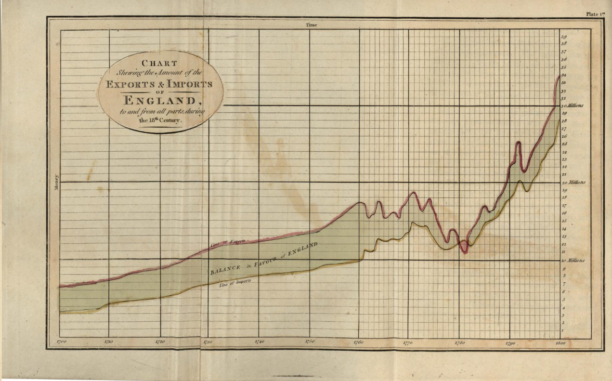
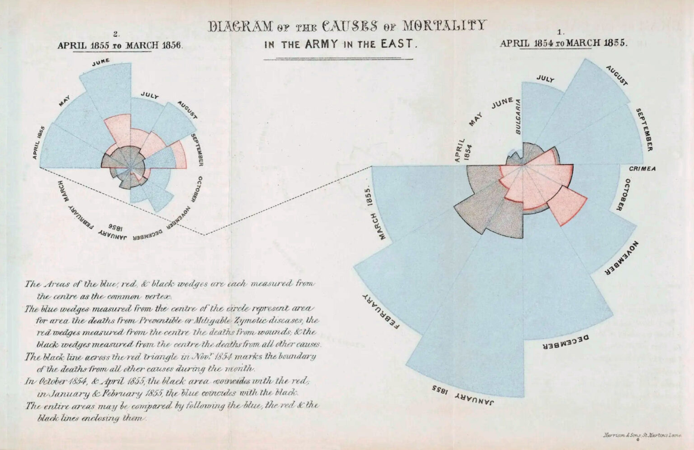
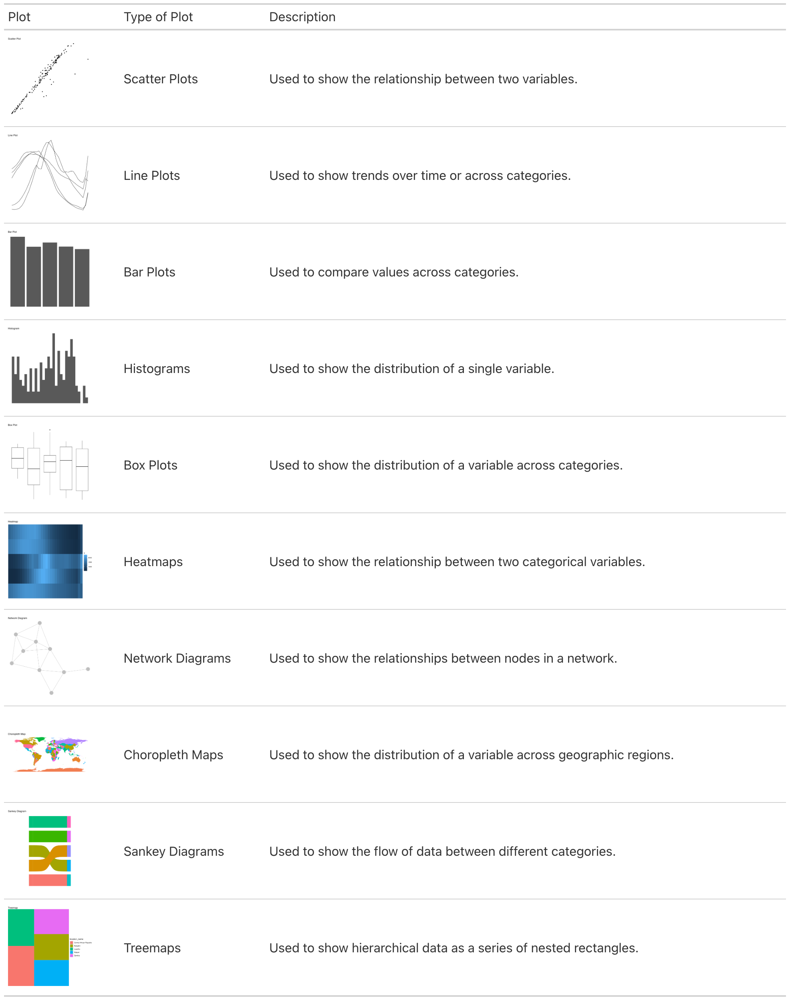
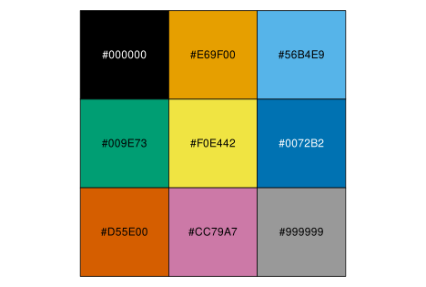

# (PART\*) Data Visualisation {-}

# Introduction to Data Visualisation

**Learning objectives:**

- History of data visualisation.

- Delve into `{ggplot2}` package and the **Grammar of Graphics**.

- See examples of visualisation for exploratory analysis and communication.

## 10.1 History of Data visualisation {-}

### Petroglyphs {-}

- [Paiute and Shoshone rock painting and carvings depicting lunar cycles and food production](https://www.nativestargazers.org/native-american/petroglyphs-of-the-eastern-sierra)

{width="75%" alt="A reddish coloured rockface with 13 pale moons in a half circle, with an image of the sun to the left and the appearance of rectangular fields or planting zones."}

### William Playfair {-}

- [Examples from The Commercial and Political Atlas, 1801.](https://archive.org/details/PLAYFAIRWilliam1801TheCommercialandPoliticalAtlas/page/n19/mode/2up?view=theater)

{alt="A line chart drawn on graph paper showing the difference between imports and exports in England from 1700 to 1800. The lines run parallel to each other and rise slowly then suddenly increase from 1780. Imports are lower than exports."}

### Florence Nightingale {-}

- [Florence Nightingale's "rose" diagrams, and other notable women who made significant contributions to data visualisation](https://digital.library.sc.edu/blogs/scholcomm/womens-history-month-leaders-in-data-visualization/)

{alt="Two rose diagrams show the number of deaths by different causes for each month from 1854 to 1855 and 1855 to 1856. Rose diagrams have segments with sizes based on the number, and are coloured depending on the type of mortality."}

### W.E.B Du Bois {-}

- [Sociologist, author and anti-racist academic who developed many visualisations to challenge harmful stereotypes about Black, African, and African American people.](https://museumcrush.org/the-turn-of-the-century-anti-racist-infographics-of-web-du-bois/)

{width="75%" alt="A red spiral with 4 diagonal lines emerging from the top of the spiral, each starting where the last line ended. The diagram shows the populations of Black or African American people living in different areas of city and rural."}

## 10.2 The Grammar of Graphics {-}

- Structured approach to creating visualisations.

- Add and modify features in 'layers'.

  - Data.
  - Aesthetics.
  - Geometries.
  - Themes.

- Many different types of charts and visualisations available.

## 10.3 General Guidelines {-}

An effective visualisation is one that:

1. Presents information clearly without being misleading.

2. Does not take a lot of effort to interpret.

3. Uses aesthetics to enhance interpretation, not distract from the facts.

4. Is not overloaded with information, such as excessive labelling.

5. Is accessible (including alternative formats).

### Common types of plots and their uses {-}

{alt="Table of different chart types. The first column shows an example of each chart. The second column provides the name of the chart type. The third column provides a use case for the chart. The chart types are: scatter plot, line plot, bar plot, histogram, box plot, heatmaps, network diagrams, choropleth maps, sankey diagrams, treemaps."}

## 10.4 Example: Visualising Lung Cancer Deaths by Prevalence and Age in Germany {-}

```{r dataset, echo=FALSE}
head(hmsidwR::germany_lungc)
```

### Scatter plot {-}

```{r lung-plot, fig.alt="A scatterplot of lung cancer deaths in Germany, showing estimated prevalence rate on the x-axis and estimated death rate on the y-axis. There are three categorical variables of sex: both, female and male, each with different shapes. The plot shows some points from the 'both' category with a higher estimated prevalence and death rate. Males have a higher prevalence and death rate than females."}

library(ggplot2)

lung_scatter <- hmsidwR::germany_lungc |>
  
  # Initialise ggplot with arguments to set the x and y 
  # aesthetics
  ggplot(aes(x = prevalence, y = dx)) +
  
  # Create a scatter plot, using sex to modify the shape 
  # aesthetic
  geom_point(aes(shape = sex)) + 
  
  # Set the title and names for x and y axes
  labs(title = "Lung Cancer Deaths by Prevalence in Germany",
       x = "Prevalence",
       y = "Deaths")

lung_scatter
```

Things to do:

1. Change the size of the points with the `size` aesthetic within `geom_point`.

2. Change the colour of the points with the `colour` argument within `geom_point`.

3. Remove the grey background with `theme`:

    - `theme_classic()` or `theme_bw()` with extra parameters do the same job.

4. Check the readability of colours for people with colour vision deficiency.

```{r scatterplot2, fig.alt="A scatterplot of lung cancer deaths in Germany, showing estimated prevalence rate on the x-axis and estimated death rate on the y-axis. There are three categorical variables of sex: both, female and male. The points are larger than in the previous plot and are different colours."}

hmsidwR::germany_lungc |>
  ggplot(
    aes(
      x = prevalence,
      y = dx,
      shape = sex,
      colour = sex)) +
  geom_point(size = 4) + 
  labs(title = "Lung Cancer Deaths by Prevalence in Germany",
       x = "Prevalence",
       y = "Deaths") +
  theme_classic() +
  theme(text = element_text(family = "Lato",
                            size = 14),
        axis.text = element_text(colour = "black"))
```


```{r scatterplot3, fig.alt="A scatterplot of lung cancer deaths in Germany, showing estimated prevalence rate on the x-axis and estimated death rate on the y-axis. There are three categorical variables of sex: both, female and male. The plot uses a lightly different theme with additional parameters to create the same features as the previous plot."}

hmsidwR::germany_lungc |>
  ggplot(
    aes(
      x = prevalence,
      y = dx,
      shape = sex,
      colour = sex)) +
  geom_point(size = 4) + 
  labs(title = "Lung Cancer Deaths by Prevalence in Germany",
       x = "Prevalence",
       y = "Deaths") +
  theme_bw() +
  theme(axis.line = element_line(colour = "black"),
        plot.background = element_blank(),
        panel.grid.major = element_blank(),
        panel.grid.minor = element_blank(),
        panel.border = element_blank(),
        text = element_text(family = "Lato",
                            size = 14),
        axis.text = element_text(colour = "black"))
```

It's ok, but maybe not for people who are colourblind.

How to check?

- [Using the `{colorblindr}` package in the example below (`cvd_grid` function).](https://github.com/clauswilke/colorblindr)

- [The `{dichromat}` package.](https://hiweller.rbind.io/post/using-the-dichromat-package-to-check-if-your-plot-is-colorblind-friendly/)

```{r colourblind-packages, eval=FALSE, include=FALSE}
remotes::install_github("wilkelab/cowplot")
install.packages("colorspace", repos = "http://R-Forge.R-project.org")
remotes::install_github("clauswilke/colorblindr")
```


```{r scatterplot4, echo=FALSE, fig.alt="Four scatterplots of lung cancer deaths in Germany, showing estimated prevalence rate on the x-axis and estimated death rate on the y-axis. The four plots simulate colour vision deficiency to demonstrate how the colours appear to people with red, green or blue colour blindness, and monochromatic vision."}
library(cowplot)
library(colorspace)
library(colorblindr)

scatter <- hmsidwR::germany_lungc |>
  ggplot(
    aes(
      x = prevalence,
      y = dx,
      shape = sex,
      colour = sex)) +
  geom_point(size = 3) + 
  labs(title = "Lung Cancer Deaths \nby Prevalence in Germany",
       x = "Prevalence",
       y = "Deaths") +
  theme_bw() +
  theme(axis.line = element_line(colour = "black"),
        plot.background = element_blank(),
        panel.grid.major = element_blank(),
        panel.grid.minor = element_blank(),
        panel.border = element_blank(),
        text = element_text(family = "sans",
                            size = 10),
        axis.text = element_text(colour = "black"))

cvd_grid(scatter)
```

Possible options:

1. Don't use colour.

2. Put black outlines around the shapes.

2. Choose a better palette.

  - The Okabe-Ito palette (below) was designed for qualitative data.
  
  - The `viridis` palette may be suitable for continuous data.
  
  - `{colorbrewer}` package has colourblind-friendly palettes.

{width="100%" alt="Okabe-Ito colour chart showing the colours and their hex codes. The codes are: Black #000000; Orange #E69F00; Sky blue #56B4E9; Bluish green #009E73; Yellow #F0E442; Blue #0072B2; Vermillion #D55E00; Reddish purple #CC79A7; Grey #999999."}

- Control colour and shape using `scale_colour_manual` and `scale_shape_manual` (necessary if modifying the legend title).

```{r scatterplot6, fig.alt="A scatterplot of lung cancer deaths in Germany, showing estimated prevalence rate on the x-axis and estimated death rate on the y-axis. The colours of the points have been changed to demonstrate how this is done with the scale_colour_manual function."}

scatter +
  labs(title = "Lung Cancer Deaths by Prevalence in Germany") +
  scale_color_manual(name = "Sex",
                     values = c("#000000", "#009E73", "#D55E00"),
                     labels = c("Both", "Female", "Male")) +
  scale_shape_manual(name = "Sex",
                     values = c(16, 17, 15),
                     labels = c("Both", "Female", "Male"))

```

- Can also use `scale_color_OkabeIto` and `scale_fill_OkabeIto`.

### Barplot {-}

```{r barplot, fig.alt="A stacked barplot of lung cancer deaths in Germany, showing age categories from 10 years to 85+ in 5-year increments on the x-axis, and estimated death rate on the y-axis. There are three categorical variables of sex: both, female and male. The bars have patterns based on the sex category of 'both', 'female', or 'male'. Deaths from lung cancer increase with age from 30-34 to 75-79, then start to decline."}
library(ggpattern)

# Create a barplot
hmsidwR::germany_lungc |>
    
  # This time, the aesthetics are age and estimated death rate 
  # with patterns for sex
  ggplot(aes(x = age, y = dx, group = sex))  +
  
  # The ggpattern package creates stacked charts with 
  # geom_col_pattern different patterns based on the sex 
  # variable
  ggpattern::geom_col_pattern(aes(pattern=sex),
                              position="stack",
                              fill= 'white',
                              colour= 'black') +
  
  # Again, set the title and names for x and y axes
  labs(title = "Lung Cancer Deaths by Age in Germany",
       x = "Age",
       y = "Deaths")
```

Things to do:

1. Create a bar chart with `geom_bar`.

2. Use faceting to separate the categories with `facet_grid`.

3. Angle the x-axis category labels with `hjust`.

4. Set the y-axis origin to 0.

```{r barplot2, message=FALSE, warning=FALSE, fig.alt="A facted grid of barplots of lung cancer deaths in Germany, showing age categories from 10 years to 85+ in 5-year increments on the x-axis, and estimated death rate on the y-axis. The barplots are arranged in three separate panels stacked on top of one another.There are three categorical variables of sex: both, female and male. Deaths from lung cancer increase with age from 30-34 to 75-79, then start to decline. Female deaths are lower than 'male' and 'both'."}

# Create a barplot
barplot <- hmsidwR::germany_lungc |>
    
  # This time, the aesthetics are age and number of deaths with 
  # patterns for sex
  ggplot(aes(x = age, y = dx))  +
  
  # The geom_bar argument is used for bar charts
  geom_bar(fill = "white",
           
           # stat = "identity" tells R to calculate the sum of 
           # the y variable, grouped by the x variable
           stat = "identity",
           
           # Add a black outline
           colour = "black") +
  
  # Set the origin for the y-axis at 0
  scale_y_continuous(expand = c(0, 0)) +
  
  # Again, set the title and names for x and y axes
  labs(title = "Lung Cancer Deaths by Age in Germany",
       x = "Age",
       y = "Deaths") +
  
  # Separate panels for each sex category, and modify the 
  # fonts and some styling
  facet_grid(sex ~ .) +
  theme_classic() +
  theme(text = element_text(family = "Lato",
                            size = 12),
        axis.text = element_text(colour = "black"),
        axis.text.x = element_text(angle = 45,
                                   hjust = 1))

barplot
```

To format the strip text in the facets, use the `labeller` argument inside `facet_grid`:

```{r barplot3, message=FALSE, warning=FALSE, fig.alt="A facted grid of barplots of lung cancer deaths in Germany, showing age categories from 10 years to 85+ in 5-year increments on the x-axis, and estimated death rate on the y-axis. The barplots are arranged in three separate panels in a row. This demonstrates a different way to use the facet_grid function and changes the sex category labels to capitalise the first letter of each label."}
# Put the categories in a list
sex_categories <- list(
  "both" = "Both",
  "female" = "Female",
  "male" = "Male"
)

# Create a function to store the new names
sex_labeller <- function(variable,value){
  return(sex_categories[value])
}

# Add the names to the strip panels
barplot +
  facet_grid(~ sex, labeller = sex_labeller) +
  theme_classic() +
  theme(text = element_text(size = 10),
        axis.text = element_text(colour = "black"),
        axis.text.x = element_text(angle = 45,
                                   hjust = 1))
```

### Line plot {-}

```{r lineplot, fig.alt="A lineplot showing lung cancer deaths in Germany, showing age categories from 10 years to 85+ in 5-year increments on the x-axis, and estimated death rate on the y-axis. The sex category variable of 'both', 'female' and 'male' is shown as three separate lines of with different line styles."}

lineplot <- hmsidwR::germany_lungc |>
  
  # Variables are age, deaths, grouped by sex
  ggplot(aes(x = age, y = dx, group = sex)) +
  
  # geom_line creates the lines, varying the type of line by sex
  geom_line(aes(linetype = sex)) +
  
  # Add points with geom_point
  geom_point() +
  labs(title = "Lung Cancer Deaths by Age in Germany",
       x = "Age",
       y = "Deaths")

lineplot
```

Lineplot

Things to do:

1. Remove the legend and add labels to the ends of the lines with package `{ggtext}`.

2. Plain background and similar formatting as before.

```{r lineplot2, fig.asp = 0.8, fig.width = 7, out.width="80%", fig.alt="A lineplot showing lung cancer deaths in Germany, showing age categories from 10 years to 85+ in 5-year increments on the x-axis, and estimated death rate on the y-axis. The sex category variable of 'both', 'female' and 'male' is shown as three separate lines of with different line styles. The legend has been removed and the sex category labels are at the end of each line. This is to demonstrate the ggtext package."}

library(ggtext)

# Subset the data to create labels based on the oldest age 
# category to put the labels at the end of the line
dat_label <- subset(hmsidwR::germany_lungc, age == max(age))

hmsidwR::germany_lungc |>
  
  # Same variables as before
  ggplot(aes(x = age, y = dx, group = sex)) +
  
  # geom_line creates the lines, varying the type of line by 
  # sex; remove the legend
  geom_line(aes(linetype = sex),
            show.legend = FALSE) +
  
  # Use the subsetted data created to add the labels
  ggtext::geom_richtext(data = dat_label,
                        label.color = NA,
                        aes(label = sex)) +
  labs(title = "Lung Cancer Deaths by Age in Germany",
       x = "Age",
       y = "Deaths") +
  theme_classic() +
  theme(text = element_text(family = "Lato",
                            size = 14),
        axis.text = element_text(colour = "black"),
        axis.text.x = element_text(angle = 45,
                                   hjust = 1))
```

## 10.4.1 Colours and Patterns {-}

- Important for highlighting key information.

- Used to improve readability for sighted people.

- Default colour palettes may not be the best.

- Use of patterns may be a personal preference.

- `scale_colour_manual` (don't forget `scale_shape_manual` if using shapes).

## 10.4.2 Theme, Legends and Guides {-}

- Use `theme` to customise non-data elements of a plot.

- Many built-in themes.

- Create your own theme and save as a template.

- Change default theme with `theme_set()` function.

```{r example-theme}
theme_scatter <- function(base_size = 14) {
  theme_bw(base_size = base_size) %+replace%
    theme(
      axis.line = element_line(colour = "black"),
      plot.background = element_blank(),
      panel.grid.major = element_blank(),
      panel.grid.minor = element_blank(),
      panel.border = element_blank(),
      text = element_text(family = "sans",
                          size = 12),
      axis.text = element_text(colour = "black")
    )
}

scatter +
  theme_scatter()
```

- The use of `%+replace%` replaces theme elements.

- `guides` and `guide` can be used with `scale` to fine-tune plot design and layout.

```{r guides1, fig.alt="A lineplot showing lung cancer deaths in Germany, showing age categories from 10 years to 85+ in 5-year increments on the x-axis, and estimated death rate on the y-axis. The sex category variable of 'both', 'female' and 'male' is shown as three separate lines of with different line styles. The legend is at the top of the plot instead of on the left, and the sex category names are in reverse order."}
# Customising a legend to a plot
lineplot1 <- lineplot +
  labs(
    linetype = "Sex",
    subtitle = "Year 2019",
    caption = "DataSource: hmsidwR::germany_lungc"
  ) +
  guides(linetype = guide_legend(reverse = TRUE)) +
  theme_classic() +
  theme(
    legend.position = "top",
    axis.text.x = element_text(angle = 45, hjust = 1),
    plot.title = element_text(hjust = 0.5, face = "bold")
  )

lineplot1
```


```{r guides2, fig.alt="A lineplot showing lung cancer deaths in Germany, showing age categories from 10 years to 85+ in 5-year increments on the x-axis, and estimated death rate on the y-axis. The sex category variable of 'both', 'female' and 'male' is shown as three separate lines of with different line styles. The y-axis has been scaled using log to the base 10 to demonstrate the use of the function scale_y_log10."}

lineplot2 <- lineplot1 + 
  
  # Apply a log base 10 scale to the y axis
  scale_y_log10() + 
  
  # Allows for the drawing of data points anywhere on the plot
  coord_cartesian(clip = "off") +
  annotate("text", x = Inf, y=Inf, 
           hjust = 1, vjust = 0,
           label = "Log Scale") +
  theme_classic()

lineplot2
```

## 10.4.3 Plot Layouts {-}

```{r eval=FALSE, include=TRUE}
# Example: Arranging multiple plots
library(gridExtra)

grid.arrange(lineplot, lineplot1, lineplot2, ncol = 3)
```

## 10.4.4 Saving as an image {-}

- Getting relative sizes of text, titles, labels and chart can be challenging.

- Use `rel()` for relative sizes in your custom theme.

- Set parameters for code chunks.

```{r eval=FALSE, include=TRUE}
theme_bw(base_size = 14) %+replace%
    theme(
      # The figure
      plot.title = element_text(size = rel(1)),
      
      # Remove the minor gridlines and border
      panel.grid.minor = element_blank(),
      panel.border = element_blank(),
      
      # Specify the axes
      axis.title = element_text(size = rel(0.90)),
      axis.text = element_text(size = rel(0.80)),

      # The legend
      legend.title = element_text(size = rel(0.80)),
      legend.text = element_text(size = rel(0.70)),
      legend.key = element_rect(fill = "transparent",
                                colour = NA),
      legend.background = element_rect(fill = "transparent",
                                       colour = NA)
    )

```

- Within a code chunk:

  - `fig.asp` - from 0 to 1.
  
  - `fig.width` - integer.
  
  - `fig.height` - integer.
  
  - `out.width` - a percentage.
  
  - `out.height` - a percentage.
  
```{r eval=FALSE, include=TRUE}
knitr::opts_chunk$set(
 fig.width = 5,
 fig.asp = 0.7,
 out.width = "75%"
)
```

Finally...

```{r eval=FALSE, include=TRUE}
ggsave("lineplot.png", plot = lineplot2, width = 6, height = 4)
```

## 10.5 Practising Data Visualisation {-}

- [TidyTuesday.](https://www.tidytuesday.com)

- [30DayChartChallenge.](https://github.com/30DayChartChallenge/Edition2025)

- [30DayMapChallenge.](https://30daymapchallenge.com)

### Considerations for accessibility {-}

Making something accessible means designing a product or service in such a way that people are not excluded from using it due to a disability or impairment.

Important to plan for:

- Contrast.

- Visual impairments (blindness, low vision, myopia, presbyopia, hypermetropia).

- Colour vision deficiency (colour-blindness).

  - Colour blindness affects approximately 1 in 12 men (8%) and 1 in 200 women (0.5%).
  - Protanopia (red-blind): no shades of red can be seen.
  - Protanomaly (red-weak): some shades of red may be seen.
  - Deuteranopia (green-blind): no shades of green can be seen.
  - Deuteranomaly (green-weak): some shades of green may be seen.
  - Tritanopia (blue-blind): no shades of blue can be seen.
  - Tritanomaly (blue-weak): some shades of blue may be seen.
  - Monochromacy (achromatopsia): no colour, only shades of grey.
  
Conversely, approximately 12% of women possess "super colour vision" (tetrachromacy).

### Contrast {-}

W3C Content Accessibility Guidelines (WCAG) recommend a contrast ratio of:

- at least 4.5 for regular text on a background colour;

- at least 3 for large text, graphics and UI components (e.g., form input borders).

Contrast ratio is defined by W3C as $\frac{L1 + 0.05}{L2 + 0.05}$, where $L1$ and $L2$ are relative luminance (brightness) of lighter and darker colours.

For sRGB, relative luminance is $L = (0.2126 \times R) + (0.7152 \times G) + (0.0722 \times B)$

Useful packages to try:

- [`{coloratio}` by Matt Dray.](https://matt-dray.github.io/coloratio/)

- [`contrast_ratio()` function in the `{colorspace}` package.](https://colorspace.r-forge.r-project.org/reference/contrast_ratio.html)

### Vision impairments {-}

#### Alternative text {-}

[A excellent blog post has been written by Amy Casel who provides the following template: alt = "[chart type] of [data type(s)] where [reason for including chart]."](https://nightingaledvs.com/writing-alt-text-for-data-visualization/)

Alt text can be added to code chunks, within the chunk parameters, with `alt="description of chart"`.

### Accessible data tables {-}

- Provide alternative formats for datasets, such as a data table in CSV or ODS format.

- The table should be made with correct markup for headings and column names.

[Examples of how to structure accessible tables can be found in the Guidance Hub of the UK Government Analysis Function, Data visualisation: tables](https://analysisfunction.civilservice.gov.uk/policy-store/data-visualisation-tables/).

- [`{aftable}` package to generate spreadsheet outputs that follow best practice for accessibility.](https://best-practice-and-impact.github.io/aftables/index.html)

### Additional packages for accessibility {-}

- [`{shinya11y}` creates an overlay to review accessibility of Shiny apps.](https://github.com/ewenme/shinya11y)

- [`{BrailleR}` provides support for blind users.](https://ajrgodfrey.github.io/BrailleR/)

- [`{sonify}` turns data into sound.](https://cran.r-project.org/web/packages/sonify/index.html)

- [`{tactileR}` to create tactile graphics.](https://github.com/jooyoungseo/tactileR)

## Meeting Videos {-}

### Cohort 1 {-}

`r knitr::include_url("https://www.youtube.com/embed/URL")`

<details>
<summary> Meeting chat log </summary>

```
LOG
```
</details>
