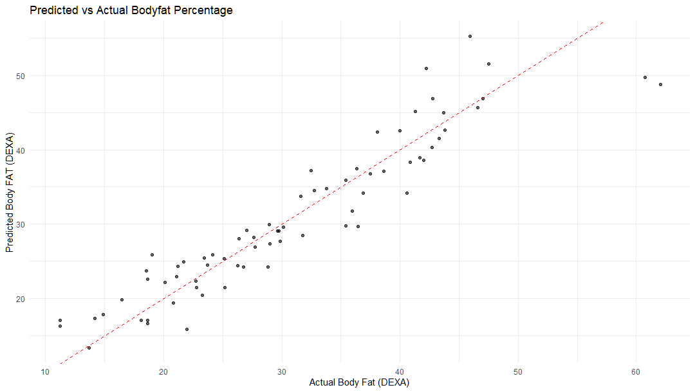
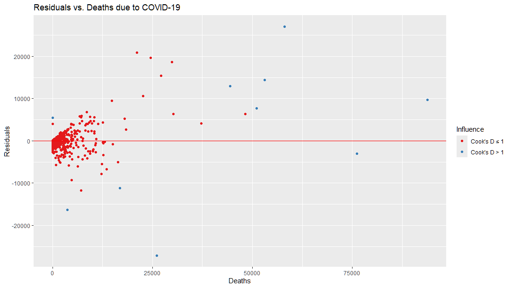

# Interpreting Model Results Through Visualisation

**Learning objectives:**

 - Visualize predicted vs. observed values and assess residuals
 - Interpret model metrics with VIP, accuracy, and partial dependency plots
 - Create and customize ROC curves and compute AUC for classification models


## Why Plot Model Fits? {-}

 - Single measures like MSE or $R^2$ can occasionally be misleading
 

 

## Predicted vs Actual Plots {-}

 - Predicted vs Actual Plot: Scatter of model predictions vs observed values
 - 45° line = perfect match of prediction and actual (very rare!)
 - Near line = predictions close to true values (high accuracy)
 - Far off line = larger errors, indicators performing less well
 - Can reveals patterns of bias: e.g. consistent under-prediction or over-prediction

<BR>



## Residual Plots {-}

 - Residual = Actual – Predicted: measures error for each prediction
 - Residual Plot: residuals on y-axis vs. predicted value or input on x axis
 - Ideal outcome: Residuals normally distributed around 0 (no pattern)
 - A pattern in residuals indicates model misspecification (e.g. curve suggests missing non-linear term)
 - Heteroskedasticity: Residuals get bigger with x axis (fan shape), error variance isn’t constant and std errors may be wrong
 - Can identify outliers: Large residuals may indicate points that distort or need investigating


## Influential Observations {-}

 - High-Leverage Point: An observation with extreme values (far from the average input/output)
 - These points pull linear model fit disproportionately (can change slope/coefficients)
 - High leverage + large residual = Influential outlier (can skew model)
 - Can use diagnostics like Cook’s Distance (in stats package) to identify influential points
 - Investigate high-leverage cases and consider fixes if needed

```r

library(RColorBrewer)

data_pred |> 
  mutate(cook_over_1 = cooks.distance(mod3) > 1) |> 
  ggplot(aes(Deaths, Residuals, colour = cook_over_1)) +
  geom_point() +
  geom_hline(yintercept = 0, color = "red") +
  scale_colour_manual(values = brewer.pal(3, "Set1")[1:2],
                      labels = c("Cook's D ≤ 1", "Cook's D > 1"),
                      name = "Influence") +
  labs(title = "Residuals vs. Deaths due to COVID-19",
       x = "Deaths", y = "Residuals")

```



## Comparing Models {-}

 - Multiple Models Comparison: e.g. bar chart of R²/AIC for each model
 - Actual vs Predicted with additional aesthetic or facet for each model
 - Aids the choice of model / specification / hyperparameters
 


## Communicating Results {-}

 - Some models conducive to clear visualisation, e.g. decision-tree model can be ploted with {rpart.plot}
 - This sets out the fitted algorithmic choices and their effect on the predicted outputs


 - Random forests can show variable importance plots
 - These show the ranked importance of each predictive element
 - Low ranking elements can be dropped if little effect on the model
 


 - Neither visualisation makes a *causal* claim, but can often give clues to make inferences.

## ROC Plots {-}

 - ROC curve = Sensitivity (True positive rate) vs. 1–Specificity (False Positive Rate) across all thresholds – shows the trade-off.
 - AUC (Area Under Curve) is the overall performance indicator (1.0 = perfect, 0.5 = chance). Higher AUC = better model on average.
 - Use ROC to pick a threshold that fits your needs: E.g., for initial diagnoses, you might choose a threshold giving high sensitivity (accepting more false positives to catch more true cases).
 - If false positives are costly, pick a threshold with higher specificity (fewer false alarms, but you may miss some positives).
 - Compare models with ROC/AUC: a higher AUC or a curve closer to the top-left means a stronger model.
 


## Partial Independence Plots {- }

 - Plot how prediction / output changes with changes in one input
 - **Assuming** other variables held constant (typically at average for the dataset)
 - Can show marginal effects or key thresholds as the value of the input changes
 - Need to be aware that assuming other variables don't change may not be realistic -
    - inputs may be correlated 
 


## Conclusion {-}

- Visualising the model helps evaluating the quality of the model specification
- It can also be a boon to help communicate results to non-technical audiences
- Visualisations can also assist in fine-tuning models and evaluating individual predictor effects

## Meeting Videos {-}

### Cohort 1 {-}

`r knitr::include_url("https://www.youtube.com/embed/URL")`

<details>
<summary> Meeting chat log </summary>

```
LOG
```
</details>
